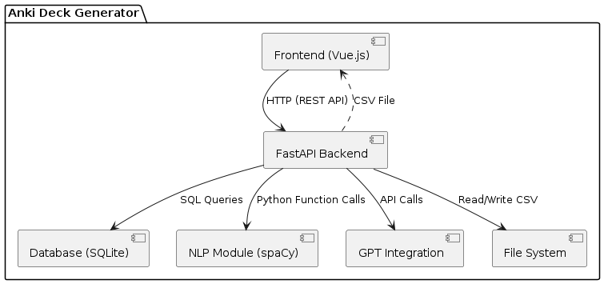
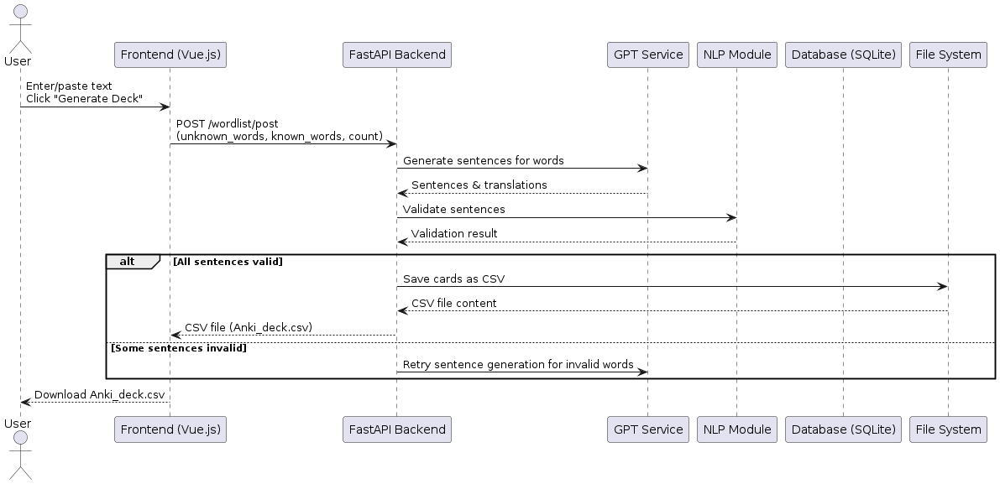
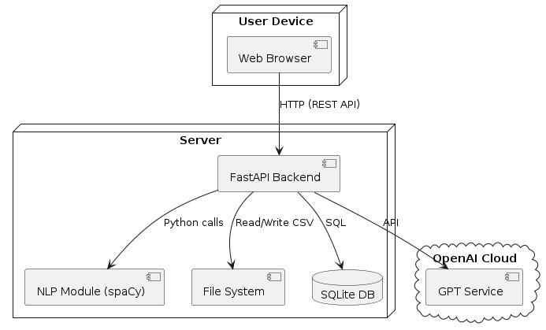

## Architecture
### Static view
  

Our codebase is organized into clear modules: API, database, NLP processing, and frontend. The API layer interacts with the database and NLP modules via well-defined interfaces, minimizing coupling. Each module is responsible for a single concern, increasing cohesion. This modularity improves the maintainability of the product, as changes in one module (e.g., NLP logic) have minimal impact on others.
### Dynamic view
  

A user submits a text to generate an Anki deck. The frontend sends the text to the FastAPI backend, which processes the text, interacts with the NLP module to extract words, queries the database for known/unknown words, and finally returns a downloadable deck. In our production environment, this scenario takes approximately 8 seconds to execute end-to-end
### Deployment view
  

The system is deployed as follows:
Frontend: Runs in the user's browser, served via a static web server. Backend: FastAPI application running selfhosted (Dockerized for portability). Database:file with data stored in the user`s memory. NLP/ML Models: Packaged with the backend, can be containerized for scalability. This setup allows easy deployment on the customer’s side. 
